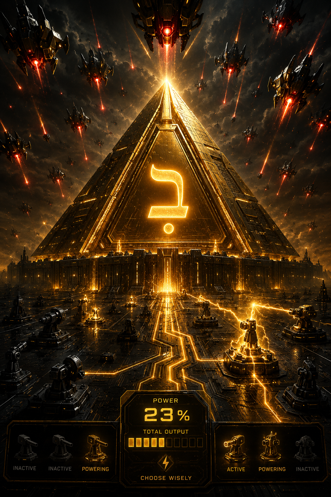

# Mishmar Protocol



**מִשְׁמָר** — *the watch; the guard post.*
A 2D defense game about powerless machines and a finite amount of power.
You protect a dark-gold pyramid bearing an illuminated Bet  — the House — from drones descending
from the top of the screen. Your defenders start dim, inert, and useless. Everything you do
is about getting power into them, deciding how to divide it, and choosing where it goes.

This repository currently holds a **playable vertical slice**: the movement and combat loop,
with no economy. It is one self-contained HTML file with no build step and no dependencies.

---

## Play it

### ▶ [TRY DEMO HERE](https://jameskeithharwood.com/mishmar-protocol)

Open `mishmar-protocol-prototype.html` in any modern browser. That's the whole install.

### The loop, in one sentence

Draw a packet of energy from a battery, sweep up as many dim drones as you dare while it
burns down, press to commit the squad, drag them where you want them, and release — whatever
energy survived the trip is split among however many drones you're still holding.

### Controls

| Action | What it does |
|---|---|
| **Move the pointer** | Dim drones inside the magnetic radius bend toward you and are recruited when they arrive |
| **Click a lit battery** | Draws one energy packet. The ring on your cursor is that packet burning down |
| **Press and hold** | Commits the squad you've gathered. Gathering stops — this is your decision point |
| **Drag** | Carries the squad. Energy is still burning, so distance costs power |
| **Release** | Sets them down. They light up and patrol that sector on their own |
| **Space** | Pause |
| **R** | Restart |

### The rule that matters

One packet is a **fixed energy budget**, split at the moment you release:

```
charge_per_drone = min(max_charge, remaining_energy / drones_held)
```

Drain is flat, so a drone at 25% burns out in roughly a quarter of the time a drone at 100%
does. That single rule is the entire tactical game:

- **Three drones, dropped close.** They burn white-gold, do full damage, and hold a sector
  for about fourteen seconds of active fighting. A scalpel.
- **Twelve drones, hauled across the field.** They arrive faint, do a quarter damage, and
  fade in a few seconds. A wall — broad coverage, briefly.
- **Take too long.** You're standing over a big swarm with nothing left to give it.

The number beside your cursor (`drop → 8 × 44%`) is what you'd get if you released right now.
It falls every time another drone joins, and it keeps falling while you carry them. Watch it.

### What can go wrong

- **The packet runs dry mid-carry.** The squad falls dim exactly where you're standing. No
  penalty is applied — you simply have to walk back to a battery and come get them.
- **Powerless drones can be destroyed.** Enemies never hunt them deliberately, but anything
  that runs into one kills it. Charged drones only lose charge on contact.
- **Batteries take damage.** A damaged battery rebuilds packets more slowly; a destroyed one
  stops entirely. The two banks sit at opposite ends of the ground, so losing one doesn't just
  halve your supply — it doubles your travel.
- **The pyramid falls.** Its seams fail, its surface fractures, and the Bet dims as it takes
  damage. At zero, the run ends.

### Reading the field

Charge is shown two ways on purpose, so it survives a crowded screen and doesn't depend on
color vision: **brightness** (white-gold → gold → amber → faint) and a **charge arc** drawn
as a ring around each drone. Battery health is shown as pips rather than a color. Sectors held
by patrolling squads draw a faint dashed circle.

---

## Design rules

These are settled decisions, not open questions. They're recorded here so the next change
doesn't quietly undo one of them.

1. **Energy is the grip.** No packet, no magnetism. You cannot pre-gather a swarm and then
   go shopping for power — the clock starts when you draw, and gathering happens under it.
2. **Capture requires arrival, not overlap.** Drones accelerate toward the pointer at a capped
   speed and are only recruited when they physically reach it. Slamming the mouse onto a drone
   doesn't grab it. The visible bend cannot be skipped by the input device.
3. **The press is a commitment.** Holding stops gathering. That's the moment you decide the
   squad is the squad.
4. **Release is deployment, not attack.** Squads set down hold and patrol the sector where you
   left them, engaging what comes near, until they burn out.
5. **Burnt-out drones stay where they fought.** They go dim, drift, and are collectable again.
   The field ends up recording the history of the battle.
6. **Difficulty ramps by behavior, not health.** The first three waves are eased on count,
   spawn spacing, and descent speed, converging to the normal curve by wave four with no cliff.
7. **Nothing keys off pointer speed.** An earlier build deployed squads on a fast flick, which
   fired accidentally because gathering *requires* moving fast. Press-and-drag replaced it.

---

## Tuning

Everything is in the `CFG` object at the top of the file. No balance value lives in game logic.

| Knob | Current | What it controls |
|---|---|---|
| `pointer.energy` | `3.0` | Total charge units in one packet. The whole split model scales from this |
| `pointer.burnSeconds` | `6.0` | How long a packet survives in your hand. Timer and budget are the same variable |
| `pointer.magnetRadius` | `115` | Gathering reach |
| `pointer.patrolRadius` | `58` | How far a set-down squad drifts from its anchor |
| `drone.drainPerSec` | `0.052` | Charge lifetime. Full ≈ 19s idle, ≈ 14s firing; quarter ≈ 4.8s |
| `drone.maxCharge` | `1.0` | Ceiling on any single drone |
| `stages` | 4 bands | Charge thresholds, damage multipliers, and colors |
| `battery.cooldown` | `2.6` | Seconds to rebuild a packet |
| `battery.damagedPenalty` | `2.2` | Cooldown multiplier at zero battery health |
| `wave.easeWaves/easeSpawn/easeSpeed/easeCount` | `3 / 2.3 / 0.60 / 0.55` | The onboarding ramp |
| `startingDrones` | `14` | Drones on the field at the start of a run |

The loop runs a fixed 120 Hz simulation decoupled from rendering, capped at 8 catch-up steps
per frame so a stall can't spiral. Faults are caught per-frame and drawn on screen with the
error message and stack line; the loop keeps running and `R` clears the fault.

---

## What isn't built yet

Deliberately excluded, in this order:

- **The economy.** Salvage, repair, and fabrication. The rule was to prove the loop is fun
  before tuning numbers that only matter if it is.
- **The enemy roster.** Only the scout exists. Bomber, jammer, siphon, armored drone, and
  carrier/commander are designed but not implemented.
- **Levels.** Waves currently escalate on a formula. The plan is ten acts of ten, with a boss
  and checkpoint every tenth level, driven by a configurable threat budget.
- **Production pass.** Audio, music, settings, saves, accessibility options beyond the
  color-independent cues already in place.

## What comes after

AI integration is intentionally the *last* thing, not the first. The base game must be complete
and enjoyable without a model in the loop. When it is, the intelligence housed in the Bet-marked
pyramid can be reached through three engine-neutral interfaces already planned for: a compact
battle-state snapshot, a bounded set of legal actions and advice outputs, and an append-only
event log with deterministic wave seeds. It must tolerate latency or total unavailability, and
must never be required for pause, save, combat timing, or completion.

---

## Open questions

Honest ones, still unanswered:

- Does the trip to the battery read as **tension** or as **tax**? If those seconds feel like
  standing around rather than repositioning, the fix is a shorter cooldown and batteries placed
  further apart — not a looser rule.
- Does twelve faint drones **ever** beat four bright ones? If the answer is never, the split
  model is wrong and the game should go flat-rate.
- At a six-second burn, is running the packet dry a **risk players choose to take**, or just a
  mistake they learn to avoid? If nobody ever gambles on one more drone, the burn is too short
  for the gamble to be real.
